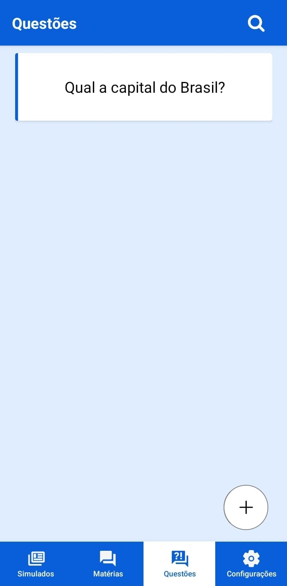
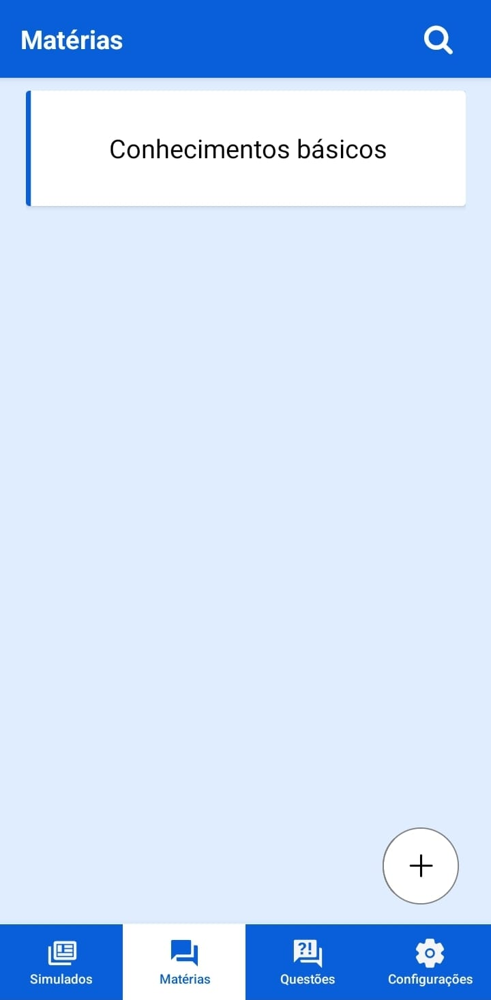
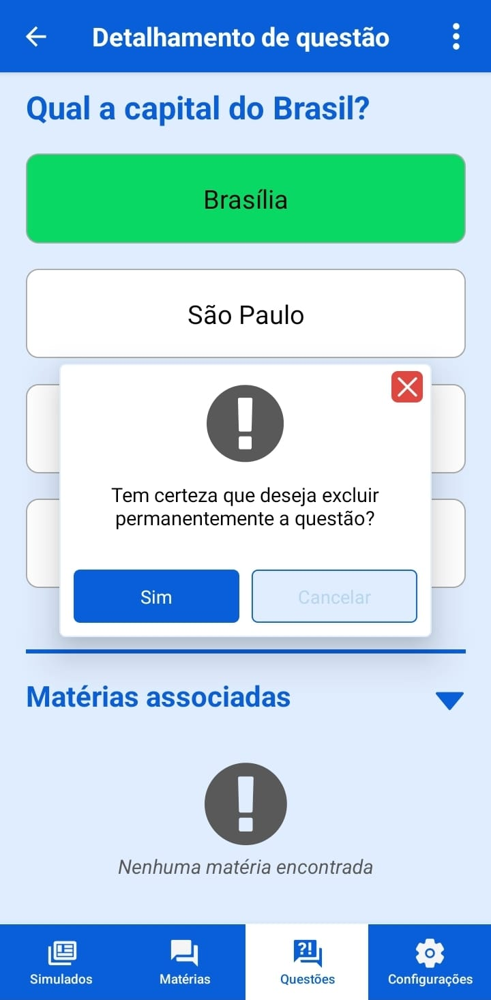
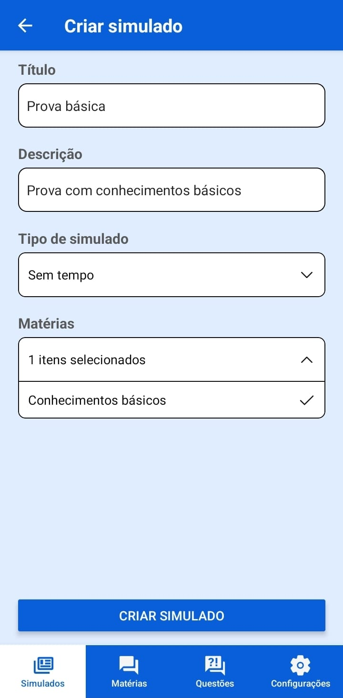
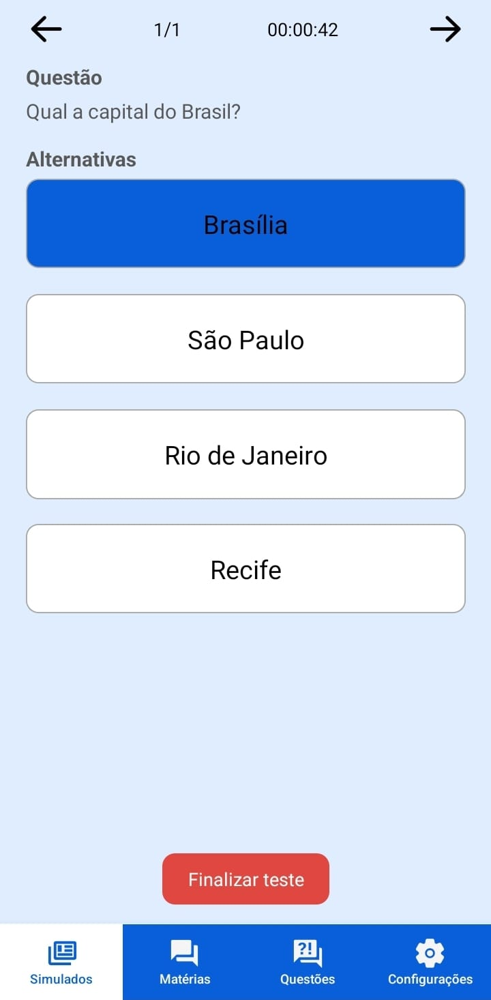
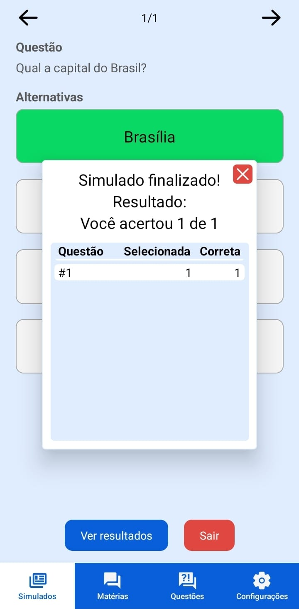
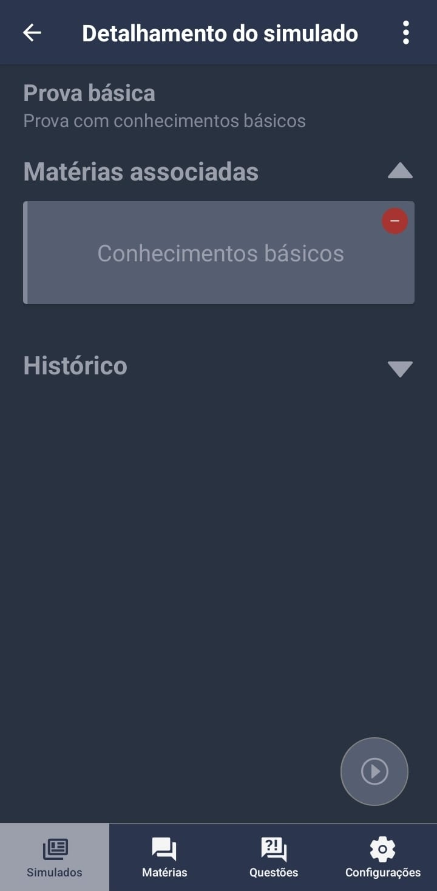

# SimulApp - Simulador de Exames

Bem-vindo ao SimulApp, o simulador de exames mobile!

## Funcionalidades Principais

- **Gerenciamento de Questões e Matérias:** Adicione questões e matérias facilmente para criar um banco de dados robusto.
- **Criação de Simulados:** Combine diferentes matérias para criar simulados personalizados.
- **Configurações Avançadas de Simulado:**
  - **Sem Tempo:** Conclua o simulado sem limite de tempo.
  - **Tempo Total:** Estabeleça um tempo limite total para terminar a prova.
  - **Tempo por Questão:** Configure um tempo específico por questão; ao atingir o tempo, a questão é bloqueada.
- **Tema configurável: Alterne entre os temas noturno e diurno da aplicação.**

## Capturas de Tela

<p align="center">



</p>

<p align="center">



</p>

<p align="center">




</p>

## Como Baixar e Executar o Projeto

1. **Clone o Repositório:**
   ```bash
   git clone https://github.com/J-Romulo/ExamsSim.git

2. **Instale as Dependências:**
   ```bash
   cd simulapp
   yarn

3. **Inicie o Projeto:**
   ```bash
   yarn start

4. **Baixe o Expo Go no seu Dispositivo Móvel:**
  - [**Expo Go para Android**](https://play.google.com/store/apps/details?id=host.exp.exponent)
  - [**Expo Go para iOS**](https://apps.apple.com/us/app/expo-go/id982107779)

5. **Leia o Código QR no Terminal com o Expo Go no seu Dispositivo para Executar o App.**

## Download do APK

- [**Link para Download do APK**](https://drive.google.com/file/d/14h6GdYTyp7u_GVOqKIFVK8ksAkD4CM0F/view?usp=drive_link)

## Tutorial de Uso

### Cadastro de Matérias:

1. Abra o aplicativo e vá para a seção de "Matérias" localizado no menu inferior.
2. Clique no botão com ícone "+"(mais) no canto inferior direito da tela.
3. Insira o título e descrição da matéria.
4. Clique em "Criar matéria".

### Cadastro de Questões:

Criando questões diretamente ligadas a uma matéria:

1. Abra o aplicativo e vá para a seção de "Matérias" localizado no menu inferior.
2. Clique na matéria que desejar associar a questão.
3. Clique no botão com ícone de mais ao lado de "Questões associadas".
4. Selecione a opção "Criar questão".
5. Insira o texto da questão.
6. Clique no botão com ícone de mais ao lado de "Alternativas" para adicionar alternativas de resposta.
7. Preencha os campos de alternativa adicionados.
8. Selecione a alternativa correta no menu que surgirá.
9. Clique em "Criar Questão".

Criando questões sem relação a máterias:

1. Abra o aplicativo e vá para a seção de "Questões" localizado no menu inferior.
2. Clique no botão com ícone "+"(mais) no canto inferior direito da tela.
3. Insira o texto da questão.
4. Clique no botão com ícone de mais ao lado de "Alternativas" para adicionar alternativas de resposta.
5. Preencha os campos de alternativa adicionados.
6. Selecione a alternativa correta no menu que surgirá.
7. Clique em "Criar Questão".

### Criação de Simulados:

1. Abra o aplicativo e vá para a seção de "Simulados" localizado no menu inferior.
2. Clique no botão com ícone "+"(mais) no canto inferior direito da tela.
3. Insira o título e descrição do simulado.
4. Selecione o tipo do simulado.
5. Selecione as matérias.
6. Clique em "Criar Simulado".

### Executando Simulados:

1. Abra o aplicativo e vá para a seção de "Simulados" localizado no menu inferior.
2. Clique no simulado que desejar iniciar.
3. Clique no botão com ícone ">" no canto inferior direito da tela.

### Fazendo o simulado:

1. Durante o simulado você pode clicar na alternativa para salvar sua resposta.
2. Para passar de questão, utilize as setas no canto superior da tela ou deslize para a direita/esquerda com o dedo.
3. Clique no botão "Finalizar teste" para encerrar o simulado
4. Ao concluir, você pode revisar as respostas corretas e incorretas.

## Problemas e Sugestões

Se você encontrar problemas ou tiver sugestões para melhorar o SimulApp, sinta-se à vontade para [abrir uma issue](https://github.com/J-Romulo/ExamsSim/issues).


